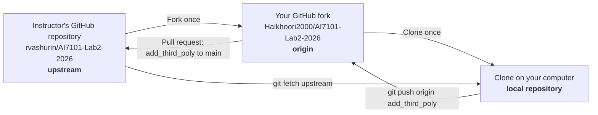

# Git and GitHub Assignment Guide

> Living guide for resolving the `add_third_poly` conflict and submitting a pull request.

## Assignment

> Resolve conflicts in the working branch `add_third_poly` by forking the repository to your account, cloning it to your computer, and merging or rebasing the working branch to make it up to date with `main`. Push the updated working branch to your fork and create a pull request to the instructor's repository.

The final submission is the URL of the pull request from the fork to the original repository.

## Student and repository details

- Student: **Hamdan Alkhoori**
- GitHub username: `Halkhoori2000`
- Instructor repository: `rvashurin/AI7101-Lab2-2026`
- Student fork: `Halkhoori2000/AI7101-Lab2-2026`
- Working branch: `add_third_poly`
- Expected pull-request destination: `rvashurin/AI7101-Lab2-2026:main`

> [!IMPORTANT]
> This guide is stored inside the assignment repository for convenience, but it
> is not part of the instructor's code. Do not use `git add .` during this
> exercise. Stage only the conflict-resolved source file, and confirm that
> `GIT_GITHUB_ASSIGNMENT_GUIDE.md` does not appear in the pull request's
> **Files changed** tab unless the instructor explicitly asks for it.

## Progress tracker

- [x] Fork the instructor's repository
- [x] Clone reported as completed
- [x] Confirm the current working directory is the fork clone
- [x] Verify `origin`
- [x] Add and verify `upstream`
- [x] Fetch the latest branches
- [x] Switch to local `add_third_poly`
- [x] Merge `upstream/main` into `add_third_poly`
- [x] Resolve the conflict in `src/housing.py`
- [x] Validate the resolved files
- [x] Create the merge commit
- [x] Push `add_third_poly` to the fork
- [ ] Create the pull request to `rvashurin:main`
- [ ] Submit the pull-request URL

## What this assignment is testing

This assignment tests whether you can complete a collaborative Git workflow:

1. Work safely through a personal fork.
2. Obtain new changes from an original repository.
3. Update an older working branch with the latest `main` branch.
4. Understand and resolve a real code conflict.
5. Record the resolution in a commit under your identity.
6. Publish the updated branch to your fork.
7. Propose the result through a pull request.

## The three copies of the repository

You work with three separate copies:



### Instructor's repository

```text
https://github.com/rvashurin/AI7101-Lab2-2026
```

This is the official repository. You normally cannot push directly to it.

### Your fork

```text
https://github.com/Halkhoori2000/AI7101-Lab2-2026
```

This is your GitHub copy. You own it, so you can push branches and commits to it.

### Your clone

This is the copy on your computer. It is where you switch branches, edit files, resolve conflicts, test code, and create commits.

Forking and cloning solve different problems:

- A **fork** gives you a writable copy on GitHub.
- A **clone** gives you a working copy on your computer.

Changes do not automatically move between these copies. `fetch` downloads Git history, while `push` uploads local commits.

## Important Git terminology

### Repository

A repository contains the project's files and their Git history.

### Commit

A commit is a saved snapshot of the project. It records the changed files, a message, a unique identifier, and author information.

### Branch

A branch is a separate line of development. This assignment uses:

- `main`: the current stable branch in the instructor's repository.
- `add_third_poly`: the working branch containing the third-degree polynomial feature.

### Remote

A remote is a saved nickname for an online Git repository.

For this assignment:

```text
origin   = your fork
upstream = the instructor's original repository
```

### Fetch

Fetching downloads commits and branch information without changing your current working files.

```bash
git fetch upstream
```

This means: "Download the latest Git information from the instructor's repository."

### Merge

A merge combines the histories and final content of two branches. This guide uses a merge because it is explicit, preserves both histories, and does not require rewriting published history.

### Conflict

A conflict happens when both branches changed overlapping lines and Git cannot safely decide what the final content should be. Git pauses so a person can combine the intended changes.

### Push

Pushing uploads local commits to an online repository.

```bash
git push origin add_third_poly
```

This means: "Upload my local `add_third_poly` branch to my fork."

### Pull request

A pull request asks the instructor to review and merge work from your fork into the original repository. Creating a pull request does not immediately modify the instructor's branch.

## Why these branches conflict

The branches started from a shared commit and then changed separately:

```text
                          main: expanded parameter grid
                         /
shared starting commit --
                         \
                          add_third_poly: third-degree model and shared grid
```

The relevant changes are:

- `main` added the alpha values `0.3`, `0.5`, and `0.7`.
- `add_third_poly` reorganized the parameter settings into a shared `LINEAR_GRID` variable.
- `add_third_poly` renamed the degree-2 model and introduced a degree-3 model.

Both branches edited the same area of `src/housing.py`. Git can see the overlapping line changes, but it cannot understand which programming behavior is intended. The correct result must preserve the useful work from both branches.

## End-to-end workflow

### Step 1: Fork the instructor's repository

Open:

```text
https://github.com/rvashurin/AI7101-Lab2-2026
```

On GitHub:

1. Select **Fork**.
2. Choose `Halkhoori2000` as the owner.
3. Keep the repository name `AI7101-Lab2-2026`.
4. Uncheck **Copy the `main` branch only** so `add_third_poly` is included.
5. Select **Create fork**.

Result:

```text
https://github.com/Halkhoori2000/AI7101-Lab2-2026
```

### Step 2: Clone your fork

```bash
git clone https://github.com/Halkhoori2000/AI7101-Lab2-2026.git
```

Enter the cloned repository:

```bash
cd AI7101-Lab2-2026
```

Cloning automatically gives the fork the remote name `origin`.

### Step 3: Verify `origin`

```bash
git remote -v
```

The `origin` fetch and push addresses should both use `Halkhoori2000`:

```text
origin  https://github.com/Halkhoori2000/AI7101-Lab2-2026.git (fetch)
origin  https://github.com/Halkhoori2000/AI7101-Lab2-2026.git (push)
```

If `origin` uses `rvashurin`, the clone is connected directly to the instructor's repository rather than the fork.

You can correct that existing clone without downloading it again:

```bash
git remote set-url origin https://github.com/Halkhoori2000/AI7101-Lab2-2026.git
```

Verify the correction:

```bash
git remote -v
```

Do not continue until `origin` points to `Halkhoori2000`. After Step 4,
`upstream` must point to `rvashurin`.

### Step 4: Add the instructor's repository as `upstream`

First use `git remote -v` to determine whether `upstream` already exists. If it is missing, add it:

```bash
git remote add upstream https://github.com/rvashurin/AI7101-Lab2-2026.git
```

Verify again:

```bash
git remote -v
```

Expected relationship:

```text
origin   -> Halkhoori2000/AI7101-Lab2-2026
upstream -> rvashurin/AI7101-Lab2-2026
```

Git may display both fetch and push addresses for `upstream`, but this workflow only fetches from it. Do not push directly to `upstream`.

### Step 5: Verify the commit identity

Check the name and email that Git will record:

```bash
git config user.name
```

```bash
git config user.email
```

If either value is missing or incorrect, configure it for this repository:

```bash
git config user.name "HAMDAN ALKHOORI"
```

```bash
git config user.email "16003363+Halkhoori2000@users.noreply.github.com"
```

These values identify the merge commit. They do not insert your name into the Python code.

### Step 6: Fetch the latest branch information

Fetch from your fork:

```bash
git fetch origin
```

Fetch from the instructor:

```bash
git fetch upstream
```

After fetching, references such as these represent the latest downloaded remote states:

```text
origin/add_third_poly
upstream/main
upstream/add_third_poly
```

Fetching does not change the files in the currently checked-out branch.

### Step 7: Inspect and switch branches

List local and remote branches:

```bash
git branch --all
```

If `add_third_poly` does not yet exist as a local branch, create it from the fork's branch:

```bash
git switch --create add_third_poly --track origin/add_third_poly
```

If `origin/add_third_poly` is unavailable but `upstream/add_third_poly` exists, use:

```bash
git switch --create add_third_poly --track upstream/add_third_poly
```

If the local branch already exists, switch to it:

```bash
git switch add_third_poly
```

If that shorter command reports that `add_third_poly` matched multiple remote
tracking branches, Git has found both `origin/add_third_poly` and
`upstream/add_third_poly`, but no local branch yet. It cannot safely guess which
one should become the local branch. Explicitly choose the branch in your fork:

```bash
git switch --create add_third_poly --track origin/add_third_poly
```

Type `add_third_poly` without backslashes. The resulting local branch will
start from your fork's copy and track it for future pushes.

Confirm the current branch:

```bash
git status
```

Expected:

```text
On branch add_third_poly
```

This is important because Git merges changes **into the currently checked-out branch**.

### Step 8: Merge the instructor's latest `main`

While on `add_third_poly`, run:

```bash
git merge upstream/main
```

Read this as:

> Bring the instructor's latest `main` into my current `add_third_poly` branch.

The direction is:

```text
upstream/main -> add_third_poly
```

This command modifies only your local repository. It does not modify either GitHub repository.

Git should merge `.gitignore` and `notebooks/experiment.ipynb` automatically, then stop because `src/housing.py` contains a conflict.

### Step 9: Understand the conflict markers

Open `src/housing.py`. Git will have inserted sections similar to:

```text
<<<<<<< HEAD
content from the current add_third_poly branch
=======
content coming from upstream/main
>>>>>>> upstream/main
```

Because the merge was started while on `add_third_poly`:

- `HEAD` represents `add_third_poly`.
- The section below `=======` represents `upstream/main`.

Do not blindly accept only the current or incoming side. Either choice alone can discard valid work.

### Step 10: Create the correct combined code

Keep the shared `LINEAR_GRID` design from `add_third_poly`, but include the expanded alpha values from `main`:

```python
LINEAR_GRID = {
    "model__alpha": [0.001, 0.01, 0.1, 0.3, 0.5, 0.7, 1.0, 10.0],
    "model__l1_ratio": [0.0, 0.5, 1.0],
}
```

Preserve all three relevant models:

```text
simple_elastic
poly_elastic_2
poly_elastic_3
```

Each of these should use:

```python
"param_grid": LINEAR_GRID,
```

Delete every conflict-marker line:

```text
<<<<<<<
=======
>>>>>>>
```

The goal is not merely to make Git stop reporting a conflict. The final code must retain both intended developments:

```text
third-degree polynomial support and shared grid
                         +
expanded alpha values from main
                         =
correct combined implementation
```

### Step 11: Inspect and mark the conflict as resolved

Check the repository state:

```bash
git status
```

Check for whitespace errors and leftover conflict markers:

```bash
git diff --check
```

After reviewing and saving `src/housing.py`, mark it as resolved:

```bash
git add src/housing.py
```

Use the specific filename shown above. Do not use `git add .`, because that
would also stage this guide and any other unrelated untracked files.

Here, `git add` means both:

1. Include this final version in the next commit.
2. Tell Git that the conflict has been resolved.

Check the staged result:

```bash
git diff --cached --check
```

### Step 12: Validate the resolved files

Check Python syntax without running the full training process:

```bash
python3 -m compileall src
```

Check that the notebook remains valid JSON:

```bash
python3 -m json.tool notebooks/experiment.ipynb >/dev/null
```

No output from the second command means the notebook passed the JSON check.

Review the state one more time:

```bash
git status
```

There should be no files under **Unmerged paths**.

### Step 13: Create the merge commit

Create a permanent record of the completed merge:

```bash
git commit -m "Merge main into add_third_poly and resolve conflicts"
```

Inspect the recent history:

```bash
git log --oneline --graph --decorate -6
```

The merge commit connects the `main` history with the `add_third_poly` history and records the resolved result under your Git identity.

At this point, the new commit exists only on your computer.

### Step 14: Push the updated branch to your fork

```bash
git push -u origin add_third_poly
```

This uploads the branch to:

```text
Halkhoori2000/AI7101-Lab2-2026:add_third_poly
```

The `-u` saves the relationship between the local branch and the branch on your fork. Future pushes from this branch can normally use `git push`.

### Step 15: Create the pull request

Open your fork on GitHub. GitHub may display a **Compare & pull request** button after the push.

Verify the direction carefully:

```text
Base repository: rvashurin/AI7101-Lab2-2026
Base branch:     main

Head repository: Halkhoori2000/AI7101-Lab2-2026
Compare branch:  add_third_poly
```

The source and destination are:

```text
Halkhoori2000:add_third_poly -> rvashurin:main
```

- **Base** is the destination that would receive the changes.
- **Head/compare** is the source containing your completed work.

Suggested title:

```text
[Hamdan Alkhoori] Resolve add_third_poly merge conflicts
```

Suggested description:

```text
Merged the latest main branch into add_third_poly and resolved the
conflict in src/housing.py. The shared parameter grid retains the
expanded alpha values, and both degree-2 and degree-3 polynomial
models are preserved.
```

Select **Create pull request**. Do not merge or close it yourself unless the instructor asks you to.

Before creating it, inspect the **Files changed** tab and confirm that
`GIT_GITHUB_ASSIGNMENT_GUIDE.md` is not included. The pull request should
contain only the intended project changes produced by updating
`add_third_poly` with `main`.

### Step 16: Submit the pull-request URL

Copy the final URL, which will resemble:

```text
https://github.com/rvashurin/AI7101-Lab2-2026/pull/NUMBER
```

Submit that URL to the instructor.

## What the pull request proves

The pull request demonstrates that you:

- created a fork;
- worked on the required branch;
- obtained the latest upstream changes;
- updated `add_third_poly` with `main`;
- resolved the semantic code conflict;
- committed the result under your identity;
- pushed the result to your fork; and
- proposed the completed branch to the instructor's `main` branch.

## Common mistakes to avoid

- Cloning the instructor's repository instead of your fork.
- Configuring `origin` as the instructor's repository.
- Forgetting to add or fetch `upstream`.
- Running the merge while on `main` instead of `add_third_poly`.
- Merging in the wrong direction.
- Blindly selecting only the current or incoming conflict version.
- Losing the expanded alpha values from `main`.
- Losing the new degree-3 model from `add_third_poly`.
- Leaving `<<<<<<<`, `=======`, or `>>>>>>>` in the Python file.
- Forgetting `git add` after resolving the conflict.
- Pushing `main` instead of `add_third_poly`.
- Pushing directly to `upstream`.
- Creating the pull request in the opposite direction.
- Merging or closing the pull request before the instructor reviews it.
- Submitting the fork URL instead of the pull-request URL.

## Command summary

Do not paste these all at once. Run them one at a time and inspect the output.

```bash
git remote -v
# Only if origin is incorrect:
git remote set-url origin https://github.com/Halkhoori2000/AI7101-Lab2-2026.git
# Only if upstream is missing:
git remote add upstream https://github.com/rvashurin/AI7101-Lab2-2026.git
git config user.name
git config user.email
git fetch origin
git fetch upstream
git branch --all
# Only if the local add_third_poly branch does not exist:
git switch --create add_third_poly --track origin/add_third_poly
git status
git merge upstream/main
# Resolve and save src/housing.py
git diff --check
git add src/housing.py
git diff --cached --check
python3 -m compileall src
python3 -m json.tool notebooks/experiment.ipynb >/dev/null
git status
git commit -m "Merge main into add_third_poly and resolve conflicts"
git log --oneline --graph --decorate -6
git push -u origin add_third_poly
```

Some commands are conditional:

- Do not run `git remote add upstream ...` if `upstream` already exists.
- If local `add_third_poly` already exists, use `git switch add_third_poly` instead of creating it.
- If the fork does not contain `origin/add_third_poly`, create the local branch from `upstream/add_third_poly`.

## Progress notes

Use this section to record outputs, decisions, or problems while completing the assignment.

### Current state

- Fork reported as created.
- Fork reported as cloned.
- `origin` was corrected and verified as
  `Halkhoori2000/AI7101-Lab2-2026`.
- The current working directory is now confirmed as the fork-connected clone.
- `upstream` was verified as `rvashurin/AI7101-Lab2-2026`.
- `git fetch origin` completed successfully with no output, meaning there were
  no new updates to report from the fork.
- `git fetch upstream` also completed successfully with no output.
- The local repository now has current branch information from both remotes.
- A local `add_third_poly` branch was created from and configured to track
  `origin/add_third_poly`.
- `add_third_poly` is now the checked-out working branch.
- `git merge upstream/main` started successfully and paused at the expected
  conflict in `src/housing.py`.
- A read-only verification after using the merge editor found that the Result
  had not been applied to the file on disk. `src/housing.py` still has status
  `UU`, all six conflict-marker lines remain, and `LINEAR_GRID` still has the
  old five-value alpha list.
- The second resolution was saved successfully. No conflict markers remain;
  Python syntax and notebook JSON both pass; the expanded `LINEAR_GRID` is
  correct; and all three relevant models use it.
- Merge commit `0b76ebb` was created by `HAMDAN ALKHOORI` and has both
  `add_third_poly` and `upstream/main` as parents.
- The completed branch was pushed to `origin/add_third_poly`.
- The user's post-push `git status` reported that local `add_third_poly` is up
  to date with `origin/add_third_poly` and the working tree is clean.
- Next checkpoint: create the pull request from the fork's `add_third_poly` to
  the professor's `main`.

### Pull-request URL

```text
Not created yet
```

### Notes and troubleshooting

- **2026-09-03 — Ambiguous branch name:** `git switch add_third_poly` reported
  two matching remote-tracking branches. This confirms that both `origin` and
  `upstream` expose a branch with that name. The next action is to create the
  local branch explicitly with
  `git switch --create add_third_poly --track origin/add_third_poly`.
- **2026-09-03 — Incorrect `origin`:** `git remote get-url origin` returned
  `https://github.com/rvashurin/AI7101-Lab2-2026.git`. Before switching or
  merging, correct it with
  `git remote set-url origin https://github.com/Halkhoori2000/AI7101-Lab2-2026.git`
  and verify both remotes with `git remote -v`.
- **2026-09-03 — `origin` verified:** `origin` now points to
  `https://github.com/Halkhoori2000/AI7101-Lab2-2026.git`, so pushes through
  `origin` will go to the student's fork.
- **2026-09-03 — `upstream` verified:** `upstream` points to
  `https://github.com/rvashurin/AI7101-Lab2-2026.git`, so the instructor's
  latest branches can be fetched through `upstream`.
- **2026-09-03 — `origin` fetched:** `git fetch origin` completed with no
  output. This is a successful result and means the fork had no new branch
  updates to display.
- **2026-09-03 — `upstream` fetched:** `git fetch upstream` also completed
  with no output. Branch information from both remotes is now current.
- **2026-09-03 — Working branch created:**
  `git switch --create add_third_poly --track origin/add_third_poly` succeeded.
  Local `HEAD` now points to `add_third_poly`, which tracks the branch with the
  same name on the student's fork.
- **2026-09-04 — Merge in progress:** `git merge upstream/main` successfully
  began while on local `add_third_poly`. Git reported one unmerged path:
  `both modified: src/housing.py`. This is the expected conflict and must now
  be resolved manually before staging and committing.
- **2026-09-04 — First resolution not saved:** Read-only inspection found
  conflict markers at lines 28, 30, 35, 55, 57, and 62 of `src/housing.py`.
  Python syntax therefore still fails, and the expanded alpha values have not
  reached the saved Result file. No file was staged, committed, or pushed.
- **2026-09-04 — Merge verified and committed:** A second read-only inspection
  confirmed no conflict markers, valid Python syntax, valid notebook JSON, the
  expanded alpha list, and shared `LINEAR_GRID` usage by `simple_elastic`,
  `poly_elastic_2`, and `poly_elastic_3`. Commit `0b76ebb` is a valid merge
  commit authored by `HAMDAN ALKHOORI`. The guide remains untracked and was not
  included in the commit.
- **2026-09-04 — Independent thorough audit:** The merge commit's parents were
  verified as feature commit `9a3af4b` and `upstream/main` commit `9c5a85b`.
  Static semantic assertions verified the exact grid values, model names,
  degree-2 and degree-3 settings, and shared-grid references. The proposed PR
  diff contains the intended `.gitignore`, notebook, and model changes without
  whitespace errors or conflict markers. Full model training was not run
  because `scikit-learn` is not installed in the checking environment and the
  dataset may require downloading; no automated test suite is provided.
- **2026-09-04 — Push verified:** The user pushed `add_third_poly` to `origin`.
  A subsequent `git status` reported that the local branch is up to date with
  `origin/add_third_poly` and that the working tree is clean.
